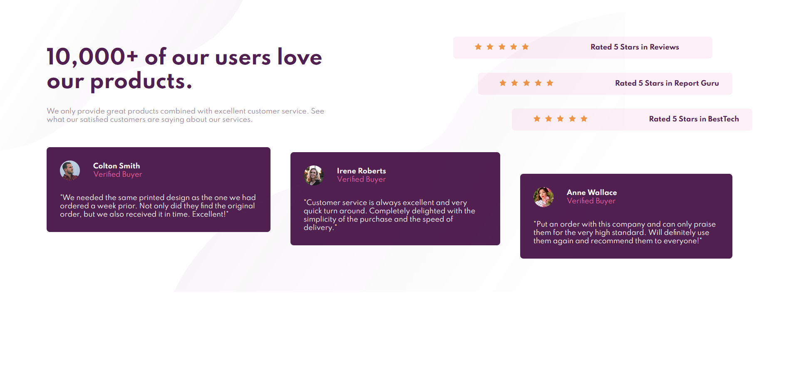
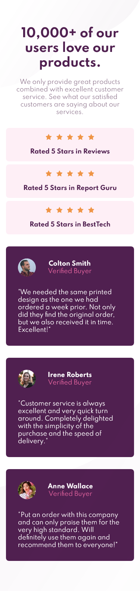

# Frontend Mentor - Social proof section solution

This is a solution to the [Social proof section challenge on Frontend Mentor](https://www.frontendmentor.io/challenges/social-proof-section-6e0qTv_bA). Frontend Mentor challenges help you improve your coding skills by building realistic projects.

## Table of contents

- [Overview](#overview)
  - [The challenge](#the-challenge)
  - [Screenshot](#screenshot)
  - [Links](#links)
- [My process](#my-process)
  - [Built with](#built-with)
- [Author](#author)
- [Acknowledgments](#acknowledgments)

**Note: Delete this note and update the table of contents based on what sections you keep.**

## Overview
 Social proof section challenge on Frontend Mentor](https://www.frontendmentor.io/challenges/social-proof-section-6e0qTv_bA)+

### The challenge

Users should be able to:

- View the optimal layout for the section depending on their device's screen size

### Final Screenshot

### Links

- Solution URL: [Add solution URL here](https://github.com/ajay0024/social-proof-section-master)
- Live Site URL: [Add live site URL here](https://ajay0024.github.io/social-proof-section-master/)

## My process
I build with mobile first workflow. I mostly used flex for layout.
### Built with

- Mobile-first workflow
- CSS custom properties
- Flexbox

## Author

- Website - https://ajay0024.github.io/cv/
- Frontend Mentor - https://www.frontendmentor.io/profile/ajay0024
- Twitter - https://twitter.com/Python72000166

## Acknowledgments

This was inspirational. Will do more.
